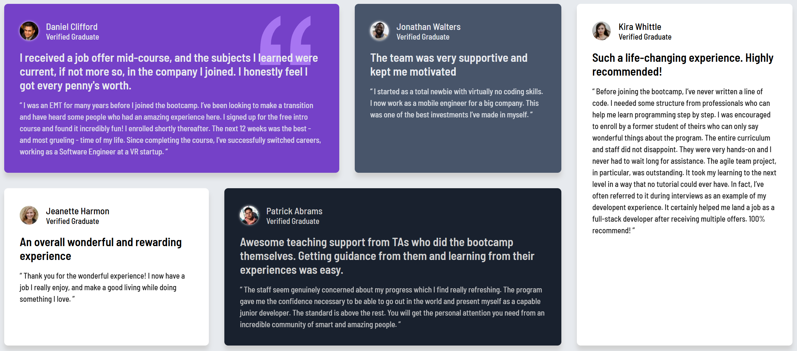

# Frontend Mentor - Testimonials grid section solution

This is a solution to the [Testimonials grid section challenge on Frontend Mentor](https://www.frontendmentor.io/challenges/testimonials-grid-section-Nnw6J7Un7). Frontend Mentor challenges help you improve your coding skills by building realistic projects.

## Table of contents

- [Frontend Mentor - Testimonials grid section solution](#frontend-mentor---testimonials-grid-section-solution)
  - [Table of contents](#table-of-contents)
  - [Overview](#overview)
    - [The challenge](#the-challenge)
    - [Screenshot](#screenshot)
      - [Desktop](#desktop)
      - [Mobile](#mobile)
    - [Links](#links)
  - [My process](#my-process)
    - [Built with](#built-with)
    - [What I learned](#what-i-learned)
    - [Continued development](#continued-development)
    - [Useful resources](#useful-resources)

## Overview

### The challenge

Users should be able to:

- View the optimal layout for the site depending on their device's screen size

### Screenshot

#### Desktop

#### Mobile

### Links

- Solution URL: [https://www.frontendmentor.io/solutions/testimonials-grid-with-3-different-layouts-Dw1Lg2XlEI](https://www.frontendmentor.io/solutions/testimonials-grid-with-3-different-layouts-Dw1Lg2XlEI)
- Live Site URL: [https://ryyhardy.github.io/fm-testimonials-grid/](https://ryyhardy.github.io/fm-testimonials-grid/)

## My process

I started with the HTML structure, which I've been steaily improving at. I went with an article for each card inside of a section representing the grid layout. Each card had a header followed by a paragraph.

For the CSS, I got the colors, fonts, and card containers looking how I wanted them to individually. Then, after taking a long hiatus from Frontend Mentor projects, I came back and finished the grid layout.

Since I was never really strong with Grid, I followed along with [this Kevin Powell video](https://www.youtube.com/watch?v=rg7Fvvl3taU) to get an idea of how to use it for this problem.

- There are 3 different grid layouts: a single-column one for mobile, the desktop design, and a 2-column layout for that weird area in between. I found that this helped mitigate a lot of the "stretchiness" that happens with a single media query (which I dealt with on previous challenges).

### Built with

- Semantic HTML5 markup
- CSS custom properties
- Flexbox
- CSS Grid
- Mobile-first workflow

### What I learned

I have much better CSS grid fundamentals now (especially with `grid-template-areas`). I also switched from using `px` for my media queries to `em` because I heard that's a more flexible approach. After some experimentation, I was able to get something that looked good on any screen size.

Also, I am starting to like the "utility class" approach to CSS. It makes naming things a lot easier. I will try to do that more in the future.

### Continued development

To be honest, I don't have many ideas on how to improve this, other than cleaning up some of the CSS.

### Useful resources

- [The Kevin Powell video I mentioned](https://www.youtube.com/watch?v=rg7Fvvl3taU)
